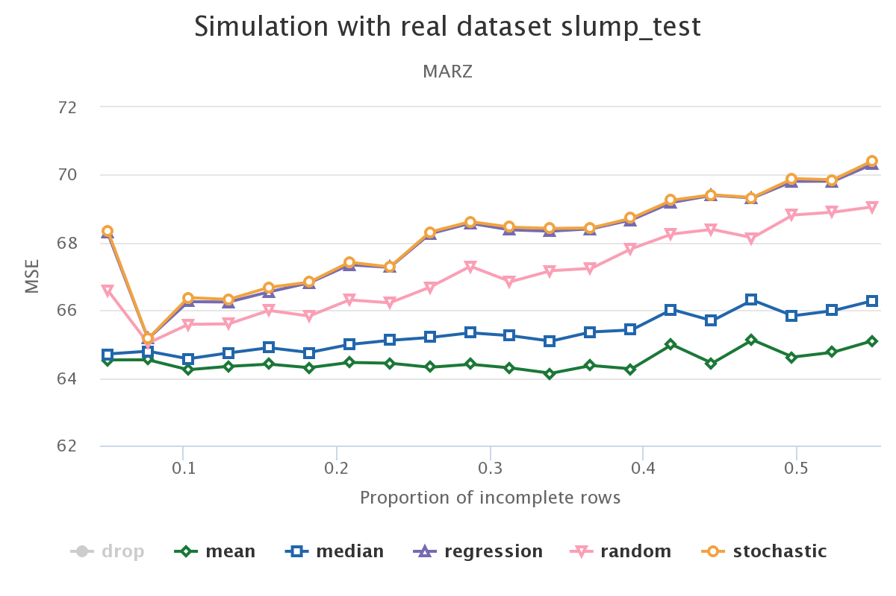

# Welcome

**Introduction**

- Rianne Schouten
- Missing Data Specialist

\vspace{1cm}
\begin{figure}
\includegraphics[width=3cm]{uu_logo}\hspace*{2mm}
\includegraphics[width=3cm]{dpa_logo}
\end{figure}

# Welcome

**Introduction**

- Rianne Schouten
- Missing Data Specialist

**What do you expect of today?**

# Welcome

**Introduction**

- Rianne Schouten
- Missing Data Specialist

**What do you expect of today?**

**In this presentation:**

- What is missing data?
- How to deal with missing data? 
- Today's challenge

# What is missing data? 

\begin{figure}
  \includegraphics[width=100mm, height=60mm]{item_vs_unit_nonresponse.png}
\end{figure}

# What is missing data?

```{r, include = FALSE}
require(mice)
require(lattice)
require(MASS)

data <- mvrnorm(mu = c(5, 10), 
                Sigma = matrix(c(1, 0.7, 0.7, 1), 2, 2), 
                n = 1000)
data <- as.data.frame(data)
names(data) <- c("outcome", "feature")
inc_data <- ampute(data, pat = c(1, 0), prop = 0.7, mech = "MCAR")$amp
```

```{r}
head(inc_data)
require(mice)
md.pattern(inc_data)
```

# What is missing data? 

- MCAR: Missingness is fixed, not related to any variable
- MAR: Missingness is related to an observed variable
- MNAR: Missingness is related to the missingness itself or to an unobserved variable

\vspace{3mm}
Example:
\vspace{2mm}

Consider outcome variable 'income' and feature 'age'

- MCAR: Some age values are missing, both older and younger ages
- MAR: Age values are missing, especially for people with a high income 
- MNAR: Age values are missing, especially for older people

# What is missing data: MCAR

Independent of value size, values on 'feature X' are missing

\begin{figure}
  \includegraphics[width=100mm, height=60mm]{MCAR.jpg}
\end{figure}

# What is missing data: MAR and MNAR based on Z

Records with a large value on 'z' are missing on 'feature X'

\begin{figure}
  \includegraphics[width=100mm, height=60mm]{M(N)ARZ.jpg}
\end{figure}

# What is missing data: MAR and MNAR based on X

Records with a large value on 'feature X' are missing on 'feature X'

\begin{figure}
  \includegraphics[width=100mm, height=60mm]{M(N)ARX.jpg}
\end{figure}

# What is missing data?

```{r, include = FALSE}
colors <- c("darkblue", "#b30000")
theme <- list(superpose.symbol = list(col = colors[1:2], pch = 19, cex = 1),
              plot.symbol = list(col = colors[1:2], pch = 1),
              strip.background = list(col = "grey95"))
key <- list(columns = 2, points = list(col = colors[1:2], pch = 19), 
            text = list(c("Complete", "Incomplete")))

inc_data <- ampute(data, pat = c(1, 0), prop = 0.3, mech = "MAR")$amp
plot_data <- data
plot_data['R'] <- is.na(inc_data$feature)
plot <- xyplot(outcome ~ feature, data = plot_data, 
               groups = R, outer = TRUE, par.settings = theme, ylab = 'variable z',
               key = key, ylim = c(2, 8), xlim = c(7, 13))
```

```{r, echo = FALSE, fig.width = 10, fig.heigth = 5}
plot
```


# How to deal with missing data? 

1. Drop incomplete rows/columns
2. Imputation
  - random imputation
  - mean/median imputation
  - regression imputation
  - random forest imputation
  - multiple imputation
  - and more...
3. Other methods such as 
  - weighting procedures
  - likelihood based methods
  - and more...
  

# How to deal with missing data: mean imputation

```{r, include = FALSE}
inc_data <- ampute(data, pat = c(1, 0), prop = 0.7, mech = "MAR")$amp
```

```{r}
head(inc_data)
```

```{r, include = FALSE}
inc_data <- ampute(data, pat = c(1, 0), prop = 0.3, mech = "MAR")$amp
```

```{r}
com_data <- inc_data
com_data[is.na(inc_data$feature), 'feature'] <- 
  mean(inc_data$feature, na.rm = TRUE)
```

# How to deal with missing data: mean imputation

```{r, include = FALSE}
theme <- list(superpose.symbol = list(col = colors[1:2], pch = 19, cex = 1),
              plot.symbol = list(col = colors[1:2], pch = 1),
              strip.background = list(col = "grey95"))
key <- list(columns = 2, points = list(col = colors[1:2], pch = 19), 
            text = list(c("Complete", "Imputed")))
com_data['R'] <- is.na(inc_data$feature)
plot <- xyplot(outcome ~ feature, data = com_data, 
               groups = R, outer = TRUE, par.settings = theme, ylab = 'variable z',
               key = key, ylim = c(2, 8), xlim = c(7, 13))
```

```{r, echo = FALSE, fig.width = 10, fig.heigth = 5}
plot
```

# How to deal with missing data: regression imputation

```{r, include = FALSE}
names(inc_data) <- c('z', 'feature')
```

```{r}
fit <- lm(feature ~ z, data = inc_data)
pred <- predict(fit, newdata = ic(inc_data))
com_data <- inc_data
com_data[is.na(inc_data$feature), 'feature'] <- pred
```

# How to deal with missing data: regression imputation

```{r, include = FALSE}
com_data['R'] <- is.na(inc_data$feature)
plot <- xyplot(z ~ feature, data = com_data, 
               groups = R, outer = TRUE, par.settings = theme, ylab = 'variable z',
               key = key, ylim = c(2, 8), xlim = c(7, 13))
```

```{r, echo = FALSE, fig.width = 10, fig.heigth = 5}
plot
```

# Today's challenge

You receive:

- an incomplete training dataset
- outcome variable (dummy) is complete
- missingness in training and testset is comparable
- combination of MCAR, MARX and MNARX

Make sure:

- you fit your imputation method on your trainingset
- and transform/apply on testset

Question:
 
- How would you evaluate whether your imputation method is okay? 

# Contact information

Ask me anything, always:\
Rianne Schouten, r.m.schouten\@uu.nl, rianne.schouten\@dpa.nl

Follow my work: [rianneschouten.github.io](https://rianneschouten.github.io/)

\vspace{1cm}
\begin{figure}
\includegraphics[width=3cm]{uu_logo}\hspace*{2mm}
\includegraphics[width=3cm]{dpa_logo}
\end{figure}

# Work in progress

[](https://rianneschouten.github.io/missing_data_science/)


